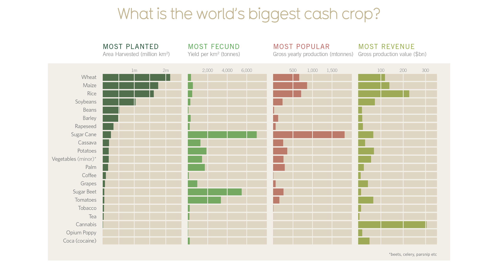
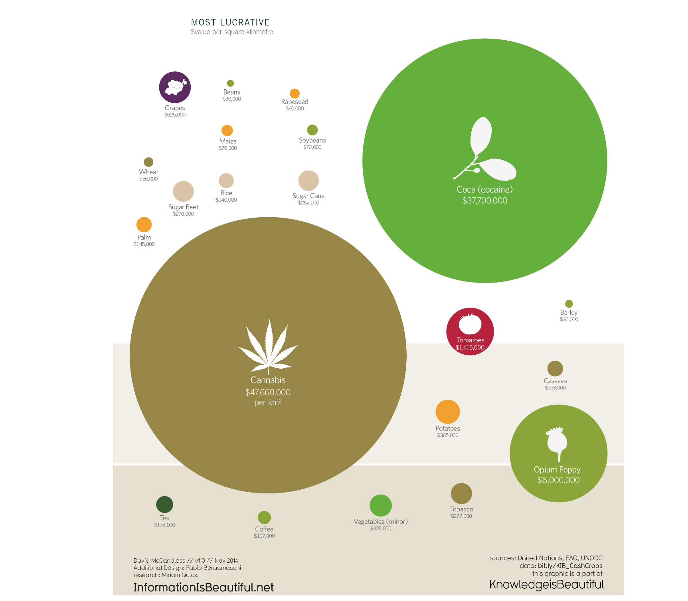
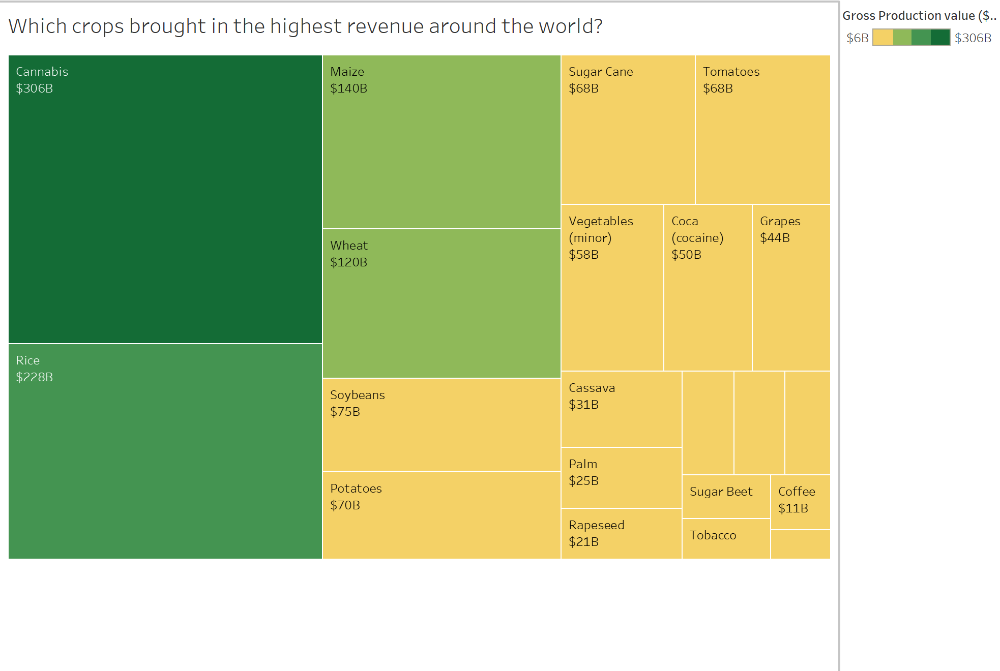

| [home page](https://nilong96.github.io/portfolio/) | [visualizing debt](visualizing-government-debt) | [critique by design](critique-by-design) | [final project I](final-project-part-one) | [final project II](final-project-part-two) | [final project III](final-project-part-three) |

# Assignment 3&4: Critique by Design

The data visualization that I decided to perform my critique and redesign is "What is the World's Biggest cash crop?". 

> Photo by David McCandless at https://informationisbeautiful.net/visualizations/what-is-the-worlds-biggest-cash-crop/

This data visualization was one of the many viz that was in the Makeover Monday selection. The reason that I choose this data visualization was because I was interested in the data. We all know that crop is an important source of energy to human body and the demand of food crop in on the increase. Due to the rise of human population, the need for food crops is constantly increasing following by the huge demand. This data visualization provided many aspect of the cash crops such as the area harvested, yield, production and revenue. 

## Critique
What stood out to me in this data visualization is the information. This visualization provided a lot of information regarding different type of the crops around the world. However, the head title of the viz did not provide a clear conclusion of what crop is the biggest cash crop. It presented a more open-ended headtitle where audience have to figure out what crops is the world's biggest cash crop based on each category.

What I find worked really well is the second visualization, the bubble. We can see it clearly that cocaine and cannabis are the most lucrative cash crops. The bubble size of the cocaine and cannabis is significantly bigger compared to the other crops. However, the downside is that the bubble size difference between cocaine and cannabis are hard to differentiate, even though the $value between two crops is drastically huge. 

Additionally, I do not believe the color utilized in the data visualization is useful. For the bubble data viz, colors were used for the crops, but I do not understand the purpose of the color. Soybeans and coca have the same color but what are their common characteristics? Additionally, the color palette utilized in the data viz are too similar to each other. There were two different types of greens, but their shades are too similar. If color is used to differentiate category, it might be better to select a wider ranged color. The color of the headtitle is also not necessary as well. The color on the headtitle does not make any changes or did any better in the data visualization. Instead, I will say that the color of the headtitle is too light and is unnecessary. 

### Recommendation
After reviewing the data visualization, there are several aspect that I want to redesign. If possible, I would like to change the head title so that it can clearly present the information that I want to show. Instead of just saying 'What is the World's Biggest Cash Crop?", I want to make the headtitle more straightforward. 

Also, I want focus on a specific category that shows a list of crops that bring in more revenue since the definition of 'Cash Crop' is crops that produces commercial value. Instead of having the audience look at all the category which shows them which is the biggest cash crops for each, we can focus on one category that reflect list of crops that bring the most revenue.

## Sketch

For my sketch, I follow my recommendations on the original data viz and only shows the 'Most Revenue' of the crops. I also selected the 'Green-Yellow' Contrast color which reflect the value from green being the highest and yellow being the lower amount. Before settling this tree map visualization, I have tried other type of visualization such as bubble, heatmap and bar chart. However, I personally feel that the tree map is the most fitting for the data that I want to present.

This original visualiation use the data set that was focus on the World's cash crop in 2014. I was able to obtain the full dataset which shows information about crops from Europe, Asia, America, Africa between 1960s to 2000s. I debated on whether I should use the 2014 World's dataset, or the full dataset since the full dataset allows me to show continuous information from 1960s to 2010s. However, I decide to use to 2014 World's dataset since the purpose was to redesign and compare between the original and my viz.

## Interviews

The first critique on my rough sketches was done by classmates during the class. I showed two sketches to my classmate which is a tree map and a line chart. The line chart was a second sketches that I use the full dataset that shows the Production Trend in Asia from 1960s to 2010s. Aftter showing both charts to my classmate, he thinks that the tree map is easier to understand compare to the line chart. The tree map is more clean and simple compare to the line chart.

I have also conducted two interviews with my coworkers regarding my data visualization. They are both female, who are in late 30s and currently a working professional. Both of their responses are shown below:

**Can you tell me what you think this is?**

* This is a representation of the overall revenue for different crops on a worldwide scale.
* the amount of money each crop brings in - cannabis being the most profitable - not only clear from amount but by the size and the color

**Can you describe to me what this is telling you?**

It is telling me that cannabis is the largest revenue crop, followed by Rice, Maize, and Wheat.

**Is there anything you find surprising or confusing?**

* No, based upon revenue I'm not surprised. I would think that if it was by some other measure (such as volume or something) it would look different, but it makes sense!
* the blank boxes, also unsure of revenue for Sugar Beet and Tobacco but assuming somewhere between $11B and $6B

**Who do you think is the intended audience for this?**

* I'm not sure - potentially someone who is thinking about investing in a crop/farm and deciding upon which to choose.
* agriculture community/growers, stakeholders

**Is there anything you would change or do differently?**

* Since both the area of each square and color represent a similar thing, I think I'd use this kind of chart with a different basis for the color. For instance, it would be interesting to see the breakdown within each block of the regions of the world - or some other thing besides a dollar value, since the square sizes themselves represent that already.
* maybe remove blank boxes or add add'l crops and their values?

