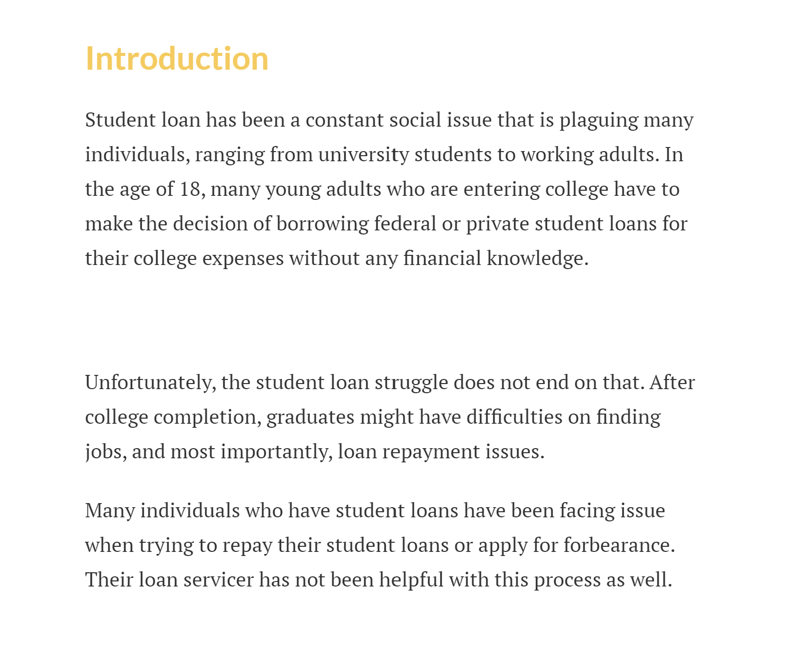
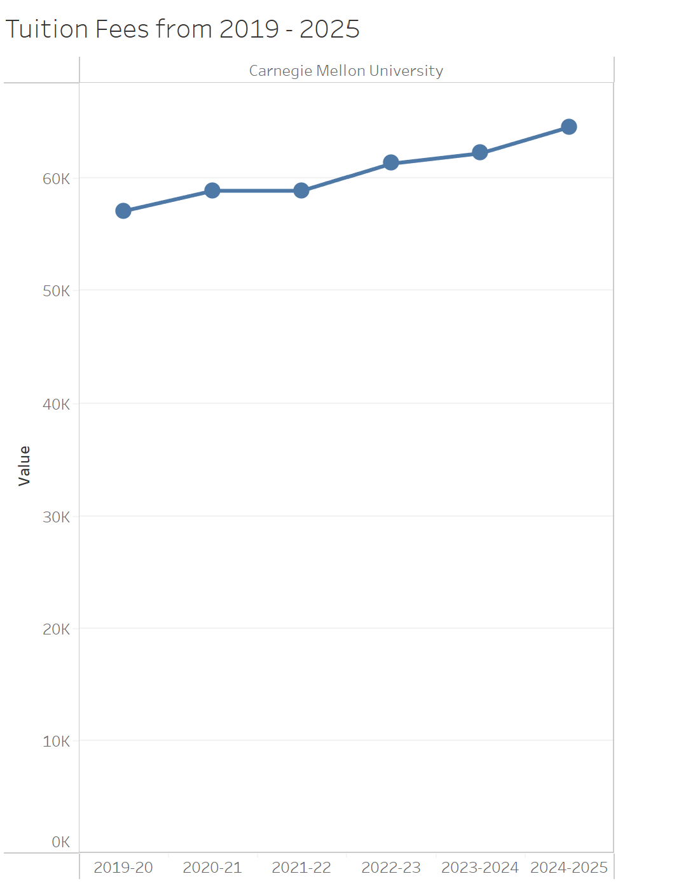
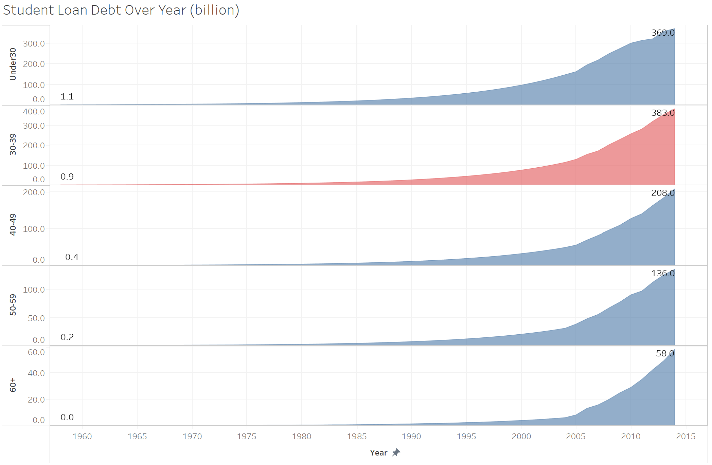
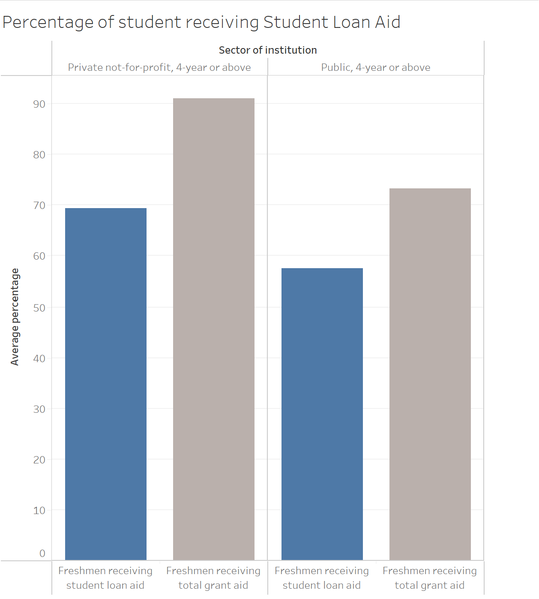

| [home page](https://nilong96.github.io/portfolio/) | [visualizing debt](visualizing-government-debt) | [critique by design](critique-by-design) | [final project I](final-project-part-one) | [final project II](final-project-part-two) | [final project III](final-project-part-three) |

# Wireframes / storyboards
**Setting**: Explain the student loan debt history, the rise of tuition expense and student loan struggle.

**Conflict**: Student loan is unavoidable since student borrow it in order to attend college. However, the real conflict is loan repayment issue with loan service provider.

**Resolution**: Using government services to put pressure on loan service provider regarding loan repayment issue.

Text here!

# User research 

## Target audience
> Include your approach to identifying representative individuals, and who you hope to reach with your story. 

My approach to identifying representative individuals is by random sampling. I will be interviewing three individuals from my workplace and personal life. They might be someone who has student loans, or does not have student loans. However, I believe that it is important to reach different individuals with different situation and experience. This way, I will be able to see different perspective from two different side and create a better storyboard.

The target audience that I hope to reach are current university student and working adults who have student loan debt. The content of my story arc is focus on student loan, and it should resonate with many individuals in United States who are struggling with their student loan debt. With the rising of university tuition expense, many students are forced to take student loan in order to cover their financial difficulties. With the information and call of action, I hope that it can provide more insight and assistance to those individuals who are struggling with their student loan. 

Interviewee 1: Female, working adults, early 30s, does not have student loan. Surrounding friends has student loan.

Interviewee 2: Female, working adults, late 20s, do have student loans. has both federal and private student loan. 

Interviewee 3: Female, working adults. early 40s, have student loans and currently has a child. 

## Interview script
> List the goals from your research, and the questions you intend to ask. 

Text here!

| Goal | Questions to Ask |
|------|------------------|
| determine whether the data viz is confusing or not |  Did data visualizations present the data clear? Is there anything you would want to change or do it differently? |
| any information that is missing | Is there any information that you wish to know or have when applying student loan and repaying it?       |
| make sure my story reach the intended audience   |   Who do you think the intended audience is?   |
| make sure my story has a clear story arc | can you tell me what the data is telling you? |

Text here!

## Interview findings
> Detail the findings from your interviews.  Do not include PII.  Capture specific insights where possible.

Text here!

| Questions               | Interview 1 (female, late 20s) | Interview 2 (female, early 30s) | Interview 3 (female, early 40s) |
|-------------------------|--------------------------------|-------------|-------------|
| Did data visualizations present the data clear? Is there anything you would want to change or do it differently | Graph 1 is easy to understand regarding the trend of the rising tuition expense. Graph 2 is slightly confusing regarding x-axis since there is no label. Additionally, it might be good to change the y-axis, making it all range. Graph 3: making it less wordy on the bottom, and possibly do away with the grant aid. | There is some confusion regarding visualization 3. The interviewee did not fully understand what ‘Total’ refer to. What does the total means? For visualization 3, is it necessary to include the graph of total grant aid? The interviewee understand the comparison the comparison between the private and public sector, but the grant aid bar graph is confusing. The grant aid bar graph is too distracting when the focus was on student loan.          | Graph 1 demonstrate that tuition fees is rising over the year. Graph 2 shows some depressing data, but it still presents the data which the interviewee was able to understand it easily. Graph 3: total grant aid is confusing. The grant aid is a little deceptive, because it doesn’t show the total amount of each student’s receiving. Delete the grant aid, just focus on student aid bar. |
| Is there any information that you wish to know or have when applying student loan and repaying it? | maybe getting a tuition expense trend of all US university. Additionally, maybe add something along the line where students are having issue finding jobs after graduation. Is the college education worth the means of borrowing student loan?  | not more data, but more personal experiences story to invoke emotion. Data and graphs are impersonal, not emotional impact. Also, it might be useful to create the structures and outline of the story.            |   See data or visualization such as interest rate for the loans. Does it show the loan is predatory? Arrange the graph presentation so that it is visually appealing and comfortable.    |
| Who do you think the intended audience is?   | potential college students, highschool seniors.         | 	It is for people who don’t have student loans. The interviewee also thought the intended audience is students who might have federal student loan now or will have it in the future.  Lastly, it might be advocate who want to forgive student loan.           |  someone who has student loan debt, and it is also an issue who has an wide range audience in age from lower 30s to 60s.            |
| can you tell me what the data is telling you? or any advice on the storyline?   | showing the trends of increasing college expenses, and student need to take more student loan for their college expenses.       |	Narrowing the story arc down from the beginning. For example, talk about one of the process (Student loan repayment issue) in the beginning to narrow It down and give a perspective.       |  If rearranging the graph, it will make it more clear. One more graph to go more into granular depth and details.        |

# Identified changes for Part III
> Document the changes you plan on implementing next week to address any issues identified.  

| Research synthesis                       | Anticipated changes for Part III                                                |
|------------------------------------------|---------------------------------------------------------------------------------|
| Findings or observations from interviews | Describe what, if any changes you anticipate making to address the observation. |
| my story is too broad and vague. It was difficult for my interviewee to grasp what i want to present about my topic  | need to create an outline and structure to correctly identify my story arc |     | the first graph has too much blank space | remove the blank space on the first visualization. need to pay more attention on the graph. Avoid too much blank space.|
| Need to see the story from the view of the audience    | Arrange the graph in an order that is easy for audience to read  |
| some variables might be not necessary. Remove variables that is not related and isolate important data. | removing the total grant aid for graph 3    |

> ...include any final thoughts you have here. 

The interview findings help a lot with my project. I learn a lot from other's people perspective, and noticed that my story still has a lot of flaw. I thought that my story outline is completed, but I realized that my topic was too broad after interviewing my friends. It is important to obtain other's people opinion since their perspective and understanding might be different from what you thought. 

